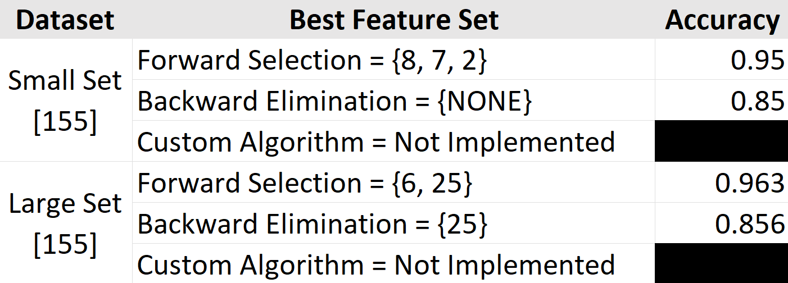

<h1 align="center"> Project #2 - Feature Selection with Nearest Neighbor (Machine Learning)</h1>
<p align="center">CS170 - Spring 2022</p>
<p align="center">Author: Sumachai Suksanguan (ssuks001@ucr.edu), SSID #: 862012822

# Solution



## In completing this project, I consulted following resources:
<ul>
<li><a href="https://developers.google.com/machine-learning/data-prep/transform/normalization">Normalization in Machine Learning</a>
<li><a href="https://scikit-learn.org/stable/modules/generated/sklearn.preprocessing.StandardScaler.html">Standard Deviation in Datasets</a>
<li><a href="https://www.analyticsvidhya.com/blog/2020/10/feature-selection-techniques-in-machine-learning/">Feature Selection in Machine Learning Overview</a>
</ul>

# Introduction

The basis of this assignment was to design a system that was able to take a `txt` file, parse the data from it, and from the dataset contained within the file, create an algorithm that is able to determine which subset of features is best suited as a "learning model" for our machine.  

Creating a system of such scale may present several issues that require the student wrap their head around, and it may be difficult if you don't split it up modularly.  As a result, the soft deadlines allowed me to view the code draconically, and design a solution, that was tweaked minimally at the end when combined during phase three.
<ol>
<li> A Dummy Driver, that uses Random Evaluation and Greedy Selection
<li> Implementing Accuracy Evaluation
<li> Combining the two, into one executable
</ol>

My design process, as well as how the functions were structured and created will be explained in detail in the later sections

To run the code, please run `make` in your terminal.  You will then see that two executable files are created, `data.exe` and `turnin.exe`.  `data.exe` may be used as one-time data tester to verify specific feature subsets and what they evaluate to.  `turnin.exe` is meant to be the fully functional executable.

# Code Design

As I mentioned above, the program was split into three phases, and during the first two phases, I created two individual classes to ensure that I knew how to correctly implement each required feature of the program.

## Phase 1 - Implementing the Search Algorithms

In this part of the project, we needed to implement two search methods: Forward Selection and Backwards Elimination.  Our algorithm would be greedy in nature, and select (at the moment), whichever child has the highest accuracy.  

The immediate issue at the moment is, how do we test that the algorithm works, if we don't have a way of testing the data and determining its true accuracy? Well, we just use random numbers for now.

### Setup

In order to get this project flowing, we needed to first set up the program to accept our user input, and set up the program with all the information it needs to run properly.  During this time, we set up an arbitrary board with a number of features. We then prompt the user to indicate whether they want to use Forward Selection or Backwards Elimination

### `class problem`

Our program will mainly run off `problem` objects, and interacting with those objects.  At this moment though, the only thing that our object needs to correctly run, are these member variables:

```c++
class problem{
    private:
        std::vector<int> features;              // Features that are currently being tested or used
        std::vector<int> remaining_features;    // Features we have yet to test
        problem* parent;                        // Pointer to previous iteration
        double accuracy;                        // Randomly generated accuracy
```
Then, it has several member functions for easy interfacing.  While the majority of these are helper functions, and specific print functions, the main drivers of the code are the `generateForwardChild()` and `generateBackwardsChild()` functions:

```c++
class problem{
    public:
        problem();
        problem(int start, int choose);
        ~problem();

        //Generate Feature Children
        problem* generateForwardChild(int index);
        problem* generateBackwardsChild(int index);

        //Print Functions
        void print();
        void printBest();
        void printSolution();

        //Helper + Getter Functions
        void fillFeatureBank(int index, int select);
        double getAccuracy();
        std::vector<int> getVector();
        problem* getParent();
        int remainingSize();
        int frontierSize();
};
```

### Code Logic

Both `generateForwardChild()` and `generateBackwardsChild()` follow the same code structure, the only difference is that they check each one uses a different vector to determine what should be checked next.  Forward Selection adds stuff to be checked to the `features` vector, while Backwards Elimation constantly pops from `features` and checks that instead.

```c++
problem* problem::generateForwardChild(int index){
    problem* temp = new problem();
    temp->problem_set = this->problem_set;
    temp->tester = this->tester;
    temp->features = getVector();
    temp->features.push_back(remaining_features.at(index));
    temp->accuracy = tester->accuracy(temp->features);
    
    std::vector<int> temp_rem = this->remaining_features;

    temp_rem.erase(temp_rem.begin() + index);

    temp->remaining_features = temp_rem;
    temp->parent = this;

    if(parent != NULL){
        if(parent->accuracy > temp->accuracy){
            accuracy_decreased = true;
        }
    }

    return temp;
}

problem* problem::generateBackwardsChild(int index){
    problem* temp = new problem();
    temp->problem_set = this->problem_set;
    temp->tester = this->tester;
    std::vector<int> temp_rem = getVector();
    temp_rem.erase(temp_rem.begin() + index);
    temp->features = temp_rem;
    temp->accuracy = tester->accuracy(temp->features);
    temp->remaining_features = this->remaining_features;
    temp->parent = this;

    if(parent != NULL){
        if(parent->accuracy > temp->accuracy){
            accuracy_decreased = true;
        }
    }

    return temp;
}
```

> Note: Both these functions are nearly identical, with the exception of how they manipulate the `features` vector.  Forward Selection uses the `features` vector as a queue that they add to, while Backwards Elimination pops from it.

How the algorithms run and function will be explained in much further detail below!

## Phase 2 - Implementing Evaluation Function and Nearest Neighbor

For the next phase of the project, I wanted to create a program that would allow me to parse through the provided data sets, build the training model, and then test how certain feature subsets affect the accuracy.  The main purpose of this program is to ensure that the testing method works, and for that, I developed three additional classes:

<ul>
<li> dataset
<li> classifier
<li> validator
</ul>

But how exactly does our data "live"?  The way the program is setup, is that it will prompt the user to select a dataset, and then the dataset will be parsed into a `classifier` object!  Each column of data is parsed, and turned into an object of type `dataset`, which is then pushed into a vector that contains those datasets, which is a member variable of `class classifier`!

### `class classifier`

As you can see, the class `classifier` can be defined below:

```c++
class classifier{
    private:
        std::vector<dataset*> datasets;
    public:
        // Constructors & Destructors
        classifier();
        ~classifier();

        // Train and Test Functions
        void parse();                                           // Also known as train()
        int test(int instance_index, std::vector<int> subsets); // Test function
        
        // Normalize Data required for Calculating Distance
        void normalizeData();

        // Distance Helper Function
        double getDistance(dataset* a, dataset* b, std::vector<int> features);

        // Getter Helper Functions
        double getDefaultRate();
        int getDataSize();
        int getFeatureSize();
        int getClassLabel(int i);

        // Void Helper Functions 
        void print();
        void subsetInput(std::vector<int> &f);
};
```

There are multiple getter helper functions that allow us to access the data in the private variables, and then a normalization utility function that normalizes all the data in their respective columns!

But why does this all matter?  The way <b>Leave-One-Out Validation</b> works, is that we create the training model based on the entire data set, with the exception of one entry, then "test" that entry in our code.  If that entry tests correctly, it improves the accuracy of that feature subset.  If it doesn't, then it decreases the accuracy.  We iterate through all datasets, excluding one specific entry each time until we finish the data set!

But how do we actually test it? and How does it know if it's successful?  That's where `getDistance()`, `test()`, and a member function from class `validator`, `accuracy()` comes into play.

### Evaluation

After we construct our dataset, which lives in object `classifier`, we then create a `validator` object that contains that classifier, and then use that to test our data!

`validator::accuracy()` iterates through the entire classifier, and performs Leave-One-Out Validation with whatever feature subset is provided to it.  During this phase, the user provides the feature subset via input.

```c++
double validator::accuracy(std::vector<int> featureSubset){
    int correct = 0;
    int result = 0;
    double percentage = 0;

    for(int i = 0; i < myClass->getDataSize(); i++){
        result = myClass->test(i, featureSubset);
        if(result == myClass->getClassLabel(i)){
            correct++;
        }
    }

    percentage = (double)correct / (double)myClass->getDataSize();

    return percentage;
}
```

Again, if the predicted subset is correct, it increases our accuracy, and if not, it decreases it.  It then returns the percentage, which is then used in the greedy search we implemented earlier!

### How do we determine the predicted label though?

Leave-One-Out is used to validate and test the data extensively, but at the smallest level, we need a way to evaluate the distance between one instance and another, which is where the `getDistance()` utility function comes into play.

`getDistance()` takes in two dataset instances as input, along with the features subset that it is evaluating, and then calculates the Euclidean distance between the two.

```c++
double classifier::getDistance(dataset* a, dataset* b, std::vector<int> features){
    std::vector<double> under = {};
    // Compute Stuff Underneath the Square Root

    for(int i = 0; i < features.size(); i++){
        double temp = b->getFeatureValue(features[i]) - a->getFeatureValue(features[i]);
        temp = pow(temp, 2);
        under.push_back(temp);
    }

    // Compute Sum of stuff under the square root

    double under_sum = 0;

    for(int i = 0; i < under.size(); i++){
        under_sum += under[i];
    }

    return std::sqrt(under_sum);
}
```

Remember, that the structure for calculating Euclidean Distance is as follows: $\sqrt{k}$, where k is represented as $\sum_{i=1}^{i=n} (x_i - y_i)^2$.

In the above code, the first `for` loop calculates every that goes under the square root, by iterating through the list of features it needs to check and compare, and then summing them all together.

Example, if given feature subset {1, 2, 4}, calculate the sum of the difference in distance from Instance A and Instance B at features 1, 2, and 4, and then sum them all together.

Then simply take the square root of the summation to get the Distance.

### Calculating Nearest Neighbor

Now that we have utility function that calculates the distance of two given points, we need to actually determine if that is the nearest neighbor.  Nearest neighbor is calculated in the `test()` function, by comparing the distance of the current test with the local minimum.

```c++
int classifier::test(int instance_index, std::vector<int>subsets){
    dataset* testInstance = datasets[instance_index];
    dataset* currentNearest = new dataset();

    double closest = std::numeric_limits<double>::max();
    for(int i = 0; i < datasets.size(); i++){
        if(i == instance_index){
            continue;
        }
        double eucl = getDistance(datasets[instance_index], datasets[i], subsets);
        if(eucl < closest){
            closest = eucl;
            currentNearest = datasets[i];
        }
    }

    return currentNearest->getInstance();
}
```

Start by initializing `double closest` to the highest possible number.  If you test an instance, and get a lower distance, update that variable, as well as designating that instance as the nearest neighbor.  At the end of `test()` return the class label of the nearest instance as the predicted label.

## Phase 3 - Connecting Everything

In phase 1, we implemented the greedy search which would determine which feature subset yielded the greatest accuracy.  And in phase 2, we implemented the evaluation method that allowed us to test how each feature subset fares.  But the thing about phase 2, is that the code was driven by user input...and we need this to be automated...so now, we need to drive the search logic, and "teach" the system how to use that!

And it's actually quite simple.  We take our very simple `problem` object, that only initially had a few member variables, and we give it access to what drives the data testing...we give it access to `classifier` and `validator` and we make those a part of it.  So now `class problem` looks a little more like this:

```c++
class problem{
    private:
        classifier* problem_set;
        validator* tester;
        std::vector<int> features;
        std::vector<int> remaining_features;
        problem* parent;
        double accuracy;
        bool accuracy_decreased;
```

So phase 1, we taught the program how to make decisions.  And phase 2, we implemented how the decisions measure up.  Now, we let the code drive itself, and evaluate and make it's own decisions!

The code we wrote in phase 1 already determines which subsets to use via manipulation and control of the `features` vector.  The code we wrote in phase 2 takes in a `features subset` vector as input, and uses that to perform a accuracy test on that specific subset in that particular dataset.  All we have to do, is automate it.

Which is simple!  Everytime `generateForwardChild()` or `generatedBackwardsChild()` runs, it manipulates the `features` vector in the appropriate manner, all we need to do is pass `features` into `validator::accuracy()` to test that specific feature subset.  What then happens is it the search algorithm will go through all possible children, obtain the best one, and then continue to narrow it down!  Completely automated!

# Dataset Details

For this assignment, I was assigned <b>Dataset 155</b>.  Both datasets are linked below:
<ul>
<li> <a href="datasets/personal_small_dataset.txt">Small Personal Set</a> - (100 Instances, 10 Features)
<li> <a href="datasets/personal_large_dataset.txt">Large Personal Set</a> - (1000 Instances, 40 Features)
</ul>

# Algorithms

## How Do we Search?

Once the user inputs which algorithm to use, Forward Selection recursively looks for the answer with `generateForwardChild()` and Backward Elimination recursively looks for the answer with `generateBackwardsChild()`.

Each function does exactly what it says it does:

`generateForwardChild()` looks to see which features have yet to be "explored" and then obtains the accuracy of that proposed child.  For example, in an empty problem set, where we have 4 features total, it will check to see the accuracy of using features 1, 2, 3 and 4.

```
Using features() {1} accuracy is 0.4
Using features() {2} accuracy is 1
Using features() {3} accuracy is 0.7
Using features() {4} accuracy is 0.531
```

All these tests are "children" that are added into a priority queue. It then greedily selects the <b>highest</b> accuracy from the pool by selecting the top of the queue, and then further expanding that.  In this example, it will select the second feature, because it has the highest accuracy at 1.

Then, once feature 2 is locked in, it will then see if there are any further routes it may possibly take!  Feature two has been selected, which means that it can potentially combined with feature 1, feature 3, or feature 4.

```
Using features() {1, 2} accuracy is 0.4
Using features() {3, 2} accuracy is 0.8
Using features() {4, 2} accuracy is 0.312
```

Then, it would select features 3 and 2, because it's the current highest child!  Features 3 and 2 have been explored, and now we have 1 and 2 left.

```
Using features() {1, 3, 2} accuracy is 0.123
Using features() {4, 3, 2} accuracy is 0.42
```

We would then select the second option, as it is the child with the highest accuracy!  We then only have the last feature, 1, left to expand.

```
Using features() {1, 4, 3, 2} accuracy is 0.512
```

At this point, that becomes our solution state, as it's the final state where all features have been explored.  From there, we find the state that has the highest accuracy!  We do this, by constantly checking the states parents nodes, and the node with the highest accuracy is the best subset!

In the above example, there are the states we explored, and their accuracies:

```
Using features() {} accuracy is 0.31
Using features() {3} accuracy is 0.7
Using features() {3, 2} accuracy is 0.8
Using features() {4, 3, 2} accuracy is 0.42
Using features() {1, 4, 3, 2} accuracy is 0.512
```

Based on this, using features {3, 2} yield the highest accuracy at 0.8!  At this point, we have yet to implement a true evaluation function, but this is the basis of how the algorithm should work!  We just need to ensure that the greedy selection is selecting the best possible option at expansion, and then expanding.

## What about Backwards Elimation?

Backwards Elimination works exactly the same as Forward Selection, but rather than exploring one feature at a time, we have all features at the start, and remove one feature at a time, check the accuracy, and then greedily select which one yields the highest accuracy after removal!  Using the same method as above, and using `generateBackwardsChild()` to recursively find the solution board.

So assuming we use the same problem state as earlier, the trace would look something like this:

<b>Assume that using all features has an accuracy of 0.24</b>

```
Using features() {2, 3, 4} accuracy is 0.12
Using features() {1, 3, 4} accuracy is 0.65
Using features() {1, 2, 4} accuracy is 0.76
Using features() {1, 2, 3} accuracy is 0.61
```

Based on this info, we see that if we remove feature 3, it actually yields the highest accuracy at 0.76! So we remove feature 3, and then expand from there!

```
Using features() {2, 4} accuracy is 0.52
Using features() {1, 4} accuracy is 0.13
Using features() {1, 2} accuracy is 0.62
```

Feature 3 has already been removed, and now we see that if we remove feature 4, it yields a much higher accuracy, so we remove feature 4 and move forward

```
Using features() {1} accuracy is 0.5
Using features() {2} accuracy is 0.9
```

Features 3 and 4 have been removed, and we are now testing removing either feature 2 or 1.  Removing feature 1 is the highest one, so we remove feature 2 and then 1.

```
Using features() {} accuracy is 0.13
```

We then do as we did above, and look for the maximum from the entire tree.

```
Using features() {1, 2, 3, 4} accuracy is 0.24
Using features() {1, 2, 4} accuracy is 0.76
Using features() {1, 2} accuracy is 0.62
Using features() {2} accuracy is 0.9
Using features() {} accuracy is 0.13
```

Based on this, we should use only feature 2 as it yields the highest accuracy of 0.9!

# Analysis

## Experiment 1 - Comparing Forward Selection vs Backwards Elimination

### How much is actually being done? 

In retrospect, you have to acknowledge how much time is spent computing the accuracy for a given subset.  When we do Forward Selection, we begin with 0 features, and that simply iterates through the dataset and obtains all instances and generates a simple percentage of it.

Assuming we're running through the large dataset, we then analyzing 1000 instances with 40 features each.

Then, you check one feature, 999 times.  Then you check another feature 999 times, then you check another feature 999 times.  For that first iteration, you essentially do `40 * 999` checks.  And that's just to determine which of the first 40 features is our best one.

However, you have to realize that that is much cheaper than what <b>Backwards Elimination</b> is doing, because of the scale of the comparisons.

### Differences

Algorithm             | Default Rate | Starting Number of Features | Comparisons |
--------------------- | ------------ | --------------------------- | ----------- |
Forward Selection     | No Features  | 1                           | 1000
Backwards Elimination | All Features | 40                          | 1000

With Backwards Elimination, you need to compute the sum of the differences of all forty features.  Now do that 999 times just for that specific subset.  Then remove one, and do it again, and again, and again.  As a result, the runtime ends up being much longer because of how much work you do initially, and the scale of it.

Forward Selection does the same amount of comparisons, but with less features.  So while the finish by checking all forty features, they only have to do it once with that particular subset.  Whereas Backwards Elimination has to do it 40 times, with all combinations of removing one subset!

```
// What Forward Selection Begins with
Using features() {1} accuracy is 0.732

// What Backwards Elimination Begins with
Using features() {40,39,38,37,36,35,34,33,32,31,30,29,28,27,26,25,24,23,22,21,20,19,18,17,16,15,14,13,12,11,10,9,8,7,6,5,4,3,2} accuracy is 0.718
```

For testing purposes, I added something to the trace to see how many computations were done via each feature appraisal, below are the code traces:

```
Using no features and "Default Rate" evaluation, I get an accuracy of 0.834%
Enter whether you want to test custom subset, or all [1/2]: 1
Enter the sub-sets you would like to use (1 - 40): 1
I made 1000 comparisons when testing this data
If you only use feature(s) {1}, accuracy should be about 0.732

Using no features and "Default Rate" evaluation, I get an accuracy of 0.834%
Enter whether you want to test custom subset, or all [1/2]: 2
I made 40000 comparisons when testing this data
If you only use feature(s) {1, 2, 3, 4, 5, 6, 7, 8, 9, 10, 11, 12, 13, 14, 15, 16, 17, 18, 19, 20, 21, 22, 23, 24, 25, 26, 27, 28, 29, 30, 31, 32, 33, 34, 35, 36, 37, 38, 39, 40}, accuracy should be about 0.696
```

Note how when using all features, as Backwards Elimination does, it did nearly 40000 computations just for one test.  Now repeat that 40 times, then 39 times, then 38 times, and you begin to see the difference in time complexity.

### Comparing Accuracy

When doing the default rate, Forward Selection and Backwards Elimination have two different meanings.

For Forward Selection, the default rate means evaluate the subset with no features, while Backwards Elimination means evaluate it with ALL features.

Below are the findings:


### Comparing Feature Set and Accuracy

As noted above, both algorithms result in finding different best feature subsets, with different corresponding accuracies, that information is listed below:


Note how oftentimes Forward Selection yields the highest accuracies.  This is probably due to the fact that being able to check to see which one is the highest and then adding is much more advantageous than starting with everything one by one.

By analyzing everything all at once via Backwards Elimination, we have no choice but to consider all information, even if that information or features may be useless.

Forward selection ensures that at each iteration, we select the most "useful" feature, which contributes to accuracy.

Backwards Elimination removes the most "useless" feature, but in doing so, doesn't make our statistics any better!

## Experiment 2 - Not Normalizing the Data

The datasets we received only have two classes, but they have continuous features that must be normalized!  This improves the accuracy and integrity of your data while ensuring that your database is easier to navigate. Put simply, data normalization ensures that your data looks, reads, and can be utilized the same way across all of the records in your customer database.

But what happens if we don't normalize the data?  Let us obtain the best feature subsets with no normalization and see what those results look like:


> Note: This image is exactly the same? But we know that the data has not been normalized, because here a trace of the values before, and after normalization, along with their values.  For simplicity, we will be conducting our functions on the baby set, containing 5 Instances and 3 features

```
Using Baby Data Set.

Program took 166 ms to parse the data

Data Pre-Normalization
1       0.01    0.02    0.02
2       0.01    0.01    0.03
1       0.02    0.03    0.02
1       0.03    0.02    0.02
2       0.05    0.01    0.05
        Done! (Program took 1 ms to normalize the data).

Data Post-Normalization
1       -0.83666        0.239046        -0.613572
2       -0.83666        -0.956183       0.153393
1       -0.239046       1.43427         -0.613572
1       0.358569        0.239046        -0.613572
2       1.5538          -0.956183       1.68732
Using no features and "Default Rate" evaluation, I get an accuracy of 0.6%
```

Despite doing this, nothing really changes, and normalizing the data is simply used to make the data easily scalable and readable, although there are some instances where not normalizing the data may result in a change of accuracy.  For example, running a test on all feature subsets of the baby set with normalization yields an accuracy of 60%, while without yields 40%

```
// With Normalization
Using features() {1,3,2} accuracy is 0.8

// Without Normalization
Using features() {1,3,2} accuracy is 0.4
```


## Experiment 3 - Effect of Number Neighbors (k)

During this assignment, we effectively ran K-Nearest Neighbors, with K being defaulted to 1 for the entirety of the simulations.  However, we know that the lower the k-value is, the more it can potentially be subjected to outliers!

On the random off-chance that a tested instances' nearest neighbor is an outlier of another class, it can be incorrectly predicted as that potential outlier.

In order to combat this, we increase the amount of Nearest Neighbors we check!  Previously, the function used to check to see if an instance was the current nearest neighbor was simply evaluating it's distance, and if it's lower than the current Minimum Distance, then that particular instance becomes our current Nearest Neighbor.

However, that implementation only works if we are using one nearest neighbor!  In order to correctly evaluate multiple nearest neighbors, we should have some sort of data structure that contains information about that instances index and distance, thus we created

### `struct NearestNode`

By creating this structure, then creating a vector of it, we can effectively store all relevant information regarding Node Information and distance.  We then further overload the comparison operator so we can effectively use `std::sort()` in order to sort the vector via distance:

```c++
    bool operator<(const NearestNode &r) const {
        return distance < r.distance;
    }
```

### Implementation

Also, we must update `classifier::test()` to also receive the amount of nearest neighbors to use as a function input.  `test()` should be privvy to how many nearest neighbors there are, in order to correctly manipulate the `nearest_neighbors` vector.

```c++
std::vector<NearestNode> nearest_neighbors = {};

if(nearest_neighbors.size() < k_nearest){
    nearest_neighbors.push_back(temp);
}
else{
    nearest_neighbors.push_back(temp);
    sort_cut(nearest_neighbors);
}

int predicted_class = evaluateNeighbors(nearest_neighbors);
```

Note the two additional helper functions used to correctly evaluate the instance of the nearest neighbors.  Per the logic in the if else statement, if the size of the `nearest_neigbor` vector is less than how large it <i>should</i> be (i.e., if we are supposed to use 3 Nearest Neighbors, and the vector size is less than 3), then simply push that instance into the vector.

If the vector is already of appropriate size, we still push that instance back into the vector, however we then run the `sort_cut()` function to effectively re-organize the data, and "cut" off the farthest neighbor.  Assuming we have a vector of size 5 already, we then add the sixth element to it, sort it via distance, and then chop off the lowest value via `pop_back()`, effectively ensuring that our vector is only 5 elements.

Then, when we have iterated through all instances, we then run the `evaluateNeighbors()` function on our vector of `NearestNodes`. and then that returns the integer of the highest appearing instance.  Implementation is easy, as it just iterates through the vector, counts instances, and returns the highest appearing one.

### Results and Differences

So now we know how implementation works, but what exactly is the difference in data?  Below are the best feature subsets when using 1-NN (Default), 3-NN, and 5-NN respectively on the sample and personal datasets:


### Analysis and Trends

Once looking at the data, it's clear to see that in a much larger dataset, i.e., the Large Datasets, oftentimes, the best feature subset to use is still the same, however by increasing the amount of neighbors we check, we increase our accuracy by 1-2% in the case of Forward Selection.

In terms of Backwards Elimination, often times, increasing the number of neighbors yieldest the highest accuracy for 3 out of 4 possible test cases.

# Conclusion

In conclusion, based on all experimentation and the entire design process, we know that using Nearest Neighbors, as well as Leave-One-Out Validator as a way to test function subsets is an effective one.  Further research could be to use a much more common and optimized Validator Method, such as K-Folding.

## Challenges

The main challenge with this program was more conceptual on how to visualize the data.  For example, plotting one feature on a graph is simply a one-dimensional graph, two features is two-dimensional, and three-features is three-dimensional.  It starts to get really confusing to mentally picture it, once we start comparing and plotting multiple features!

Thankfully, most graphs can be solved via math, which our computers absolutely excel at.  Once I was able to generalize my code, I was able to create something that is completely functional, no matter what you throw at it.

## Findings

After multiple experiments, using Forward Selection rather than Backwards Elimination is not only much more efficient in runtime, but often finds a much better answer.  For further explanation, please refer to the earlier section where I discuss the differences between Forward Selection and Backwards Elimination.

Not only that, but by pairing Forward Selection with Multiple Nearest Neighbors, we can effectively find better feature subsets and increase our accuracy, however this is not always the case, although it is much more likely when the dataset is very large.

# Dataset Traces

All Traces to Data-Sets are provided in the folders, however here is the trace for the small personal set:

```
Welcome to Chai's Feature Selection Algorithm.

Select a dataset to use:

[1] - Baby Set (5 Instances, 3 Features)
[2] - Small Set (100 Instances, 10 Features)
[3] - Large Set (1000 Instances, 40 Features)
[4] - Personal Small Dataset [155] (100 Instances, 10 Features)
[5] - Personal Large Dataset [155] (1000 Instances, 40 Features)

Please enter your selection: Using Small Generic Data Set.

Program took 3792 ms to parse the data

Type the number of the algorithm you want to run.

[1] - Forward Selection
[2] - Backward Elimination

Use Forward Selection Algorithm

Type the number of the Nearest Neighbors you want to run. (Default is 1)

[1] - Default
[3]
[5]

Using 1 Nearest Neighbor Evaluation

This dataset has 10 features (not including the class attribute), with 100 instances.

Please wait while I normalize the data...	Done! (Program took 62 ms to normalize the data).

Running nearest neighbor with no features (default rate), using "leaving-one-out" evaluation, I get an accuracy of 0.75%

Beginning Search.

Using features() {1} accuracy is 0.57
Using features() {2} accuracy is 0.54
Using features() {3} accuracy is 0.68
Using features() {4} accuracy is 0.65
Using features() {5} accuracy is 0.75
Using features() {6} accuracy is 0.61
Using features() {7} accuracy is 0.62
Using features() {8} accuracy is 0.6
Using features() {9} accuracy is 0.66
Using features() {10} accuracy is 0.64


Feature set {5} was best, accuracy is 0.75


Using features() {1,5} accuracy is 0.76
Using features() {2,5} accuracy is 0.8
Using features() {3,5} accuracy is 0.92
Using features() {4,5} accuracy is 0.75
Using features() {6,5} accuracy is 0.79
Using features() {7,5} accuracy is 0.8
Using features() {8,5} accuracy is 0.77
Using features() {9,5} accuracy is 0.73
Using features() {10,5} accuracy is 0.82


Feature set {3,5} was best, accuracy is 0.92


Using features() {1,3,5} accuracy is 0.83
Using features() {2,3,5} accuracy is 0.79
Using features() {4,3,5} accuracy is 0.84
Using features() {6,3,5} accuracy is 0.82
Using features() {7,3,5} accuracy is 0.89
Using features() {8,3,5} accuracy is 0.79
Using features() {9,3,5} accuracy is 0.82
Using features() {10,3,5} accuracy is 0.85


Feature set {7,3,5} was best, accuracy is 0.89


Using features() {1,7,3,5} accuracy is 0.88
Using features() {2,7,3,5} accuracy is 0.81
Using features() {4,7,3,5} accuracy is 0.78
Using features() {6,7,3,5} accuracy is 0.88
Using features() {8,7,3,5} accuracy is 0.8
Using features() {9,7,3,5} accuracy is 0.82
Using features() {10,7,3,5} accuracy is 0.84


(Warning, Accuracy has decreased!! Continuing search in case of local maxima)
Feature set {1,7,3,5} was best, accuracy is 0.88


Using features() {2,1,7,3,5} accuracy is 0.79
Using features() {4,1,7,3,5} accuracy is 0.77
Using features() {6,1,7,3,5} accuracy is 0.86
Using features() {8,1,7,3,5} accuracy is 0.75
Using features() {9,1,7,3,5} accuracy is 0.75
Using features() {10,1,7,3,5} accuracy is 0.75


Feature set {6,1,7,3,5} was best, accuracy is 0.86


Using features() {2,6,1,7,3,5} accuracy is 0.76
Using features() {4,6,1,7,3,5} accuracy is 0.73
Using features() {8,6,1,7,3,5} accuracy is 0.78
Using features() {9,6,1,7,3,5} accuracy is 0.71
Using features() {10,6,1,7,3,5} accuracy is 0.71


Feature set {8,6,1,7,3,5} was best, accuracy is 0.78


Using features() {2,8,6,1,7,3,5} accuracy is 0.68
Using features() {4,8,6,1,7,3,5} accuracy is 0.68
Using features() {9,8,6,1,7,3,5} accuracy is 0.72
Using features() {10,8,6,1,7,3,5} accuracy is 0.67


Feature set {9,8,6,1,7,3,5} was best, accuracy is 0.72


Using features() {2,9,8,6,1,7,3,5} accuracy is 0.7
Using features() {4,9,8,6,1,7,3,5} accuracy is 0.64
Using features() {10,9,8,6,1,7,3,5} accuracy is 0.67


Feature set {2,9,8,6,1,7,3,5} was best, accuracy is 0.7


Using features() {4,2,9,8,6,1,7,3,5} accuracy is 0.7
Using features() {10,2,9,8,6,1,7,3,5} accuracy is 0.68


Feature set {4,2,9,8,6,1,7,3,5} was best, accuracy is 0.7


Using features() {10,4,2,9,8,6,1,7,3,5} accuracy is 0.65


Forward Selection Search Completed, Total Time Elapsed: 689632 ms.

Finished Search!! The best feature subset is {3,5}, which has an accuracy of 0.92

```


